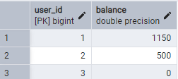

# Internet Banking API

## 📌 Описание

Этот проект представляет собой REST API для управления банковскими счетами. API позволяет пользователям выполнять основные банковские операции.

## 🛠 Технологии
- **Java 17**
- **Spring Boot** (Spring Web, Spring Data JPA)
- **PostgreSQL**
- **Hibernate**
- **REST API**

## 📂 Структура базы данных

### Таблица пользователей (`bank_account`)
| user_id | balance |
|---------|---------|
| 1       | 1000.00 |
| 2       | 500.00  |
| 3       | 0.00    |

### Таблица истории операций (`transaction_history`)
| transaction_id | user_id | type     | amount | timestamp           | related_user_id |
|----------------|---------|----------|--------|---------------------|-----------------|
| 1              | 1       | deposit  | 200.00 | 2024-04-01 12:30:00 | NULL            |
| 2              | 2       | withdraw | 50.00  | 2024-04-01 13:00:00 | NULL            |
| 3              | 1       | transfer | 100.00 | 2024-04-01 14:15:00 | 2               |

Для развертывания базы данных выполните:
```bash
psql -U postgres -d bank_db -f database_dump.sql
```

## 🌐 API Методы

### 1️⃣ Получение баланса
**Запрос:**
```
GET /api/bank/balance/{userId}
```

**Пример использования:**
```bash
curl -X GET http://localhost:8080/api/bank/balance/1
```
или
```bash
Invoke-RestMethod -Uri "http://localhost:8080/api/bank/balance/1" -Method Get
```
**Ответ:**
```json
{
  "userId": 1,
  "balance": 1000.00
}
```

### 2️⃣ Пополнение счета
**Запрос:**
```
POST /api/bank/deposit?userId={userId}&amount={amount}
```

**Пример использования:**
```bash
curl -X POST "http://localhost:8080/api/bank/deposit?userId=1&amount=200.00"
```
или
```bash
Invoke-RestMethod -Uri "http://localhost:8080/api/bank/deposit?userId=1&amount=200.00" -Method Post

```
**Ответ:**
```json
{
  "status": 1,
  "message": "Баланс успешно пополнен"
}
```

### 3️⃣ Снятие средств
**Запрос:**
```
POST /api/bank/withdraw?userId={userId}&amount={amount}
```

**Пример использования:**
```bash
curl -X POST "http://localhost:8080/api/bank/withdraw?userId=2&amount=50.00"
```
или
```bash
Invoke-RestMethod -Uri "http://localhost:8080/api/bank/withdraw?userId=1&amount=50.00" -Method Post
```
**Ответ:**
```json
{
  "status": 1,
  "message": "Операция успешна"
}
```

## 🚀 Развертывание

1. Установите PostgreSQL и создайте базу данных
2. Импортируйте дамп базы данных
3. Запустите приложение Spring Boot:
```bash
mvn spring-boot:run
```

## 📷 Скриншоты
Структура базы данных:  

